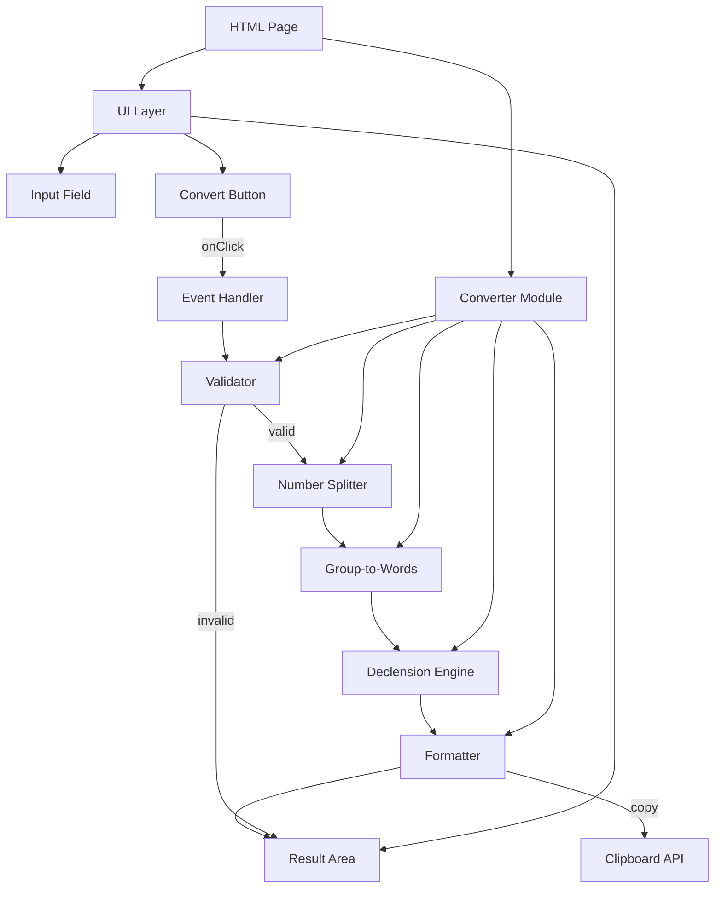

# Design Document: number-to-uah-words

## Overview

Односторінковий веб-додаток, який перетворює числові значення в текстове представлення суми в українських гривнях. Додаток складається з єдиного HTML-файлу з вбудованими CSS-стилями та JavaScript-модулем. Основний алгоритм розбиває число на групи по три цифри (мільярди, мільйони, тисячі, одиниці), перетворює кожну групу в слова з урахуванням граматичного роду та відмінків, формує фінальний рядок у форматі фінансового документа.

### Ключові проєктні рішення

1. **Один HTML-файл** — весь код (HTML, CSS, JS) розміщується в одному файлі для простоти розгортання та використання.
2. **Без зовнішніх залежностей** — жодних фреймворків чи бібліотек, чистий vanilla JS.
3. **Модульна архітектура JS** — логіка конвертації відокремлена від UI-логіки через окремі функції.
4. **Clipboard API** — використовується `navigator.clipboard.writeText()` з graceful fallback при відсутності доступу.

## Architecture



### Потік даних

1. Користувач вводить число в `Input Field`
2. Натискає `Convert Button` → спрацьовує `Event Handler`
3. `Validator` перевіряє вхідне значення
4. `Number Splitter` розбиває число на цілу та дробову частину, ціла розбивається на групи по 3 цифри
5. `Group-to-Words` перетворює кожну групу в слова (з урахуванням роду для тисяч)
6. `Declension Engine` підбирає правильну граматичну форму для розрядних слів та "гривня"/"копійка"
7. `Formatter` збирає фінальний рядок
8. Результат відображається в `Result Area`, копіюється в буфер, поле очищується

## Components and Interfaces

### 1. Validator (`validateInput`)

```javascript
/**
 * Валідує вхідний рядок з поля введення.
 * @param {string} input — сирий рядок з input field
 * @returns {{ valid: boolean, value?: number, error?: string }}
 */
function validateInput(input) { ... }
```

**Відповідальність:**
- Перевіряє що рядок не порожній
- Перевіряє що містить лише допустимі символи (0-9, `.`, `,`)
- Перевіряє що не більше одного десяткового розділювача
- Замінює кому на крапку для уніфікації
- Перевіряє що число ≥ 0 та ≤ 999999999999.99
- Повертає об'єкт з `valid: true` та розпарсеним `value`, або `valid: false` та `error`

### 2. Number Splitter (`splitNumber`)

```javascript
/**
 * Розбиває число на цілу та дробову частини.
 * @param {number} value — валідне число
 * @returns {{ integerPart: number, koppiiky: number }}
 */
function splitNumber(value) { ... }
```

**Відповідальність:**
- Відокремлює цілу частину (до 999 999 999 999)
- Обчислює копійки (0–99) з округленням
- Повертає структуру з цілою частиною та копійками

### 3. Integer-to-Words (`integerToWords`)

```javascript
/**
 * Перетворює ціле число у слова українською мовою.
 * @param {number} n — ціле число від 0 до 999999999999
 * @returns {string} — текст прописом, перша літера велика
 */
function integerToWords(n) { ... }
```

**Відповідальність:**
- Обробляє нуль як спеціальний випадок → "Нуль"
- Розбиває число на групи: мільярди, мільйони, тисячі, одиниці
- Для кожної групи викликає `groupToWords` з відповідним родом
- Додає розрядне слово у правильній формі
- Робить першу літеру великою

### 4. Group-to-Words (`groupToWords`)

```javascript
/**
 * Перетворює групу з 1-3 цифр у слова.
 * @param {number} group — число від 1 до 999
 * @param {string} gender — "masculine" | "feminine"
 * @returns {string} — слова для цієї групи
 */
function groupToWords(group, gender) { ... }
```

**Відповідальність:**
- Обробляє сотні, десятки, одиниці окремо
- Для тисяч використовує жіночий рід: "одна" замість "один", "дві" замість "два"
- Для мільйонів та мільярдів — чоловічий рід

### 5. Declension Engine (`decline`)

```javascript
/**
 * Повертає правильну форму слова відповідно до числа.
 * @param {number} n — число для якого потрібна відмінкова форма
 * @param {string[]} forms — масив з 3 форм [одна, дві-чотири, п'ять+]
 * @returns {string} — правильна форма слова
 */
function decline(n, forms) { ... }
```

**Відповідальність:**
- Визначає правильну форму за правилом: остання цифра 1 (не 11) → форма 1; остання цифра 2-4 (не 12-14) → форма 2; решта → форма 3
- Використовується для "гривня/гривні/гривень", "копійка/копійки/копійок", "тисяча/тисячі/тисяч", "мільйон/мільйони/мільйонів", "мільярд/мільярди/мільярдів"

### 6. Formatter (`formatResult`)

```javascript
/**
 * Формує фінальний рядок результату.
 * @param {string} hryvniWords — текст цілої частини прописом
 * @param {number} integerPart — ціла частина числом (для відмінювання)
 * @param {number} koppiiky — копійки числом (0-99)
 * @returns {string} — повний форматований результат
 */
function formatResult(hryvniWords, integerPart, koppiiky) { ... }
```

**Відповідальність:**
- Конкатенує: `{hryvniWords} {гривня/гривні/гривень} {XX} {копійка/копійки/копійок}`
- Копійки форматує з провідним нулем (`padStart(2, '0')`)
- Першу літеру робить великою

### 7. Event Handler (`handleConvert`)

```javascript
/**
 * Обробник натискання кнопки перетворення.
 * Оркеструє весь процес: валідація → конвертація → відображення → копіювання → очищення.
 */
function handleConvert() { ... }
```

**Відповідальність:**
- Зчитує значення з input
- Викликає `validateInput`
- При помилці — відображає повідомлення, зупиняється
- При успіху — викликає конвертацію, відображає результат
- Копіює результат в буфер обміну
- Очищує поле введення
- При помилці копіювання — показує відповідне повідомлення

## Data Models

### Таблиці відповідності (lookup tables)

```javascript
// Одиниці чоловічого роду (для мільйонів, мільярдів, одиниць)
const ONES_MASCULINE = ['', 'один', 'два', 'три', 'чотири', "п'ять", 'шість', 'сім', 'вісім', "дев'ять"];

// Одиниці жіночого роду (для тисяч)
const ONES_FEMININE = ['', 'одна', 'дві', 'три', 'чотири', "п'ять", 'шість', 'сім', 'вісім', "дев'ять"];

// Числа 10-19
const TEENS = ['десять', 'одинадцять', 'дванадцять', 'тринадцять', 'чотирнадцять', 
               "п'ятнадцять", 'шістнадцять', 'сімнадцять', 'вісімнадцять', "дев'ятнадцять"];

// Десятки
const TENS = ['', '', 'двадцять', 'тридцять', 'сорок', "п'ятдесят", 
              'шістдесят', 'сімдесят', 'вісімдесят', "дев'яносто"];

// Сотні
const HUNDREDS = ['', 'сто', 'двісті', 'триста', 'чотириста', "п'ятсот", 
                  'шістсот', 'сімсот', 'вісімсот', "дев'ятсот"];

// Розрядові слова з формами відмінювання
const SCALE_WORDS = {
  thousands: ['тисяча', 'тисячі', 'тисяч'],
  millions: ['мільйон', 'мільйони', 'мільйонів'],
  billions: ['мільярд', 'мільярди', 'мільярдів']
};

// Валюта
const HRYVNIA_FORMS = ['гривня', 'гривні', 'гривень'];
const KOPIYKA_FORMS = ['копійка', 'копійки', 'копійок'];
```

### Validation Result

```typescript
interface ValidationResult {
  valid: boolean;
  value?: number;   // присутнє коли valid === true
  error?: string;   // присутнє коли valid === false
}
```

### Split Result

```typescript
interface SplitResult {
  integerPart: number;  // 0 .. 999_999_999_999
  koppiiky: number;     // 0 .. 99
}
```

## Correctness Properties

*A property is a characteristic or behavior that should hold true across all valid executions of a system — essentially, a formal statement about what the system should do. Properties serve as the bridge between human-readable specifications and machine-verifiable correctness guarantees.*

### Property 1: Validation correctly classifies input

*For any* string, `validateInput` SHALL return `valid: true` if and only if the string contains only digits (0-9), at most one separator (dot or comma), represents a non-negative number ≤ 999999999999.99, and is non-empty; otherwise it SHALL return `valid: false` with an appropriate error message.

**Validates: Requirements 1.2, 1.4, 1.5, 1.6, 8.2**

### Property 2: Rounding preserves two-decimal precision

*For any* valid number with more than two digits after the decimal separator, `splitNumber` SHALL produce a `koppiiky` value equal to `Math.round(fractionalPart * 100)`, ensuring values in the range 0–99.

**Validates: Requirements 1.3, 4.6**

### Property 3: Declension selects correct grammatical form

*For any* integer n ≥ 0 and any triplet of forms `[form1, form2_4, form5_plus]`, `decline(n, forms)` SHALL return:
- `form1` when last digit is 1 AND last two digits ≠ 11
- `form2_4` when last digit is 2, 3, or 4 AND last two digits ∉ {12, 13, 14}
- `form5_plus` in all other cases

**Validates: Requirements 2.9, 3.1, 3.2, 3.3, 4.3, 4.4, 4.5, 6.4**

### Property 4: Feminine gender agreement for thousands

*For any* number where the thousands group has a units digit of 1 or 2, the word representation SHALL use feminine forms ("одна", "дві") instead of masculine forms ("один", "два").

**Validates: Requirements 2.8**

### Property 5: Output format structure

*For any* valid number in range [0, 999999999999.99], the formatted result SHALL match the pattern: `{Uppercase word(s)} {гривня|гривні|гривень} {DD} {копійка|копійки|копійок}` where DD is a two-digit zero-padded number (00–99), and all parts are separated by single spaces.

**Validates: Requirements 6.1, 6.2, 6.3, 4.1, 4.7, 3.4**

### Property 6: Zero-group omission in word representation

*For any* integer where one or more digit groups (billions, millions, thousands, ones) are zero, the word representation SHALL NOT contain words for those groups, and SHALL NOT contain consecutive spaces.

**Validates: Requirements 2.7**

## Error Handling

### Стратегія обробки помилок

| Сценарій | Повідомлення | Дія |
|----------|-------------|-----|
| Порожнє поле введення | "Введіть числове значення" | Відображення в Області_результату, поле не очищується |
| Недопустимі символи | "Введіть коректне числове значення" | Відображення в Області_результату, поле не очищується |
| Від'ємне число | "Значення повинно бути додатнім" | Відображення в Області_результату, поле не очищується |
| Перевищення максимуму | "Значення занадто велике" | Відображення в Області_результату, поле не очищується |
| Помилка копіювання у буфер | Результат відображається + повідомлення "Не вдалося скопіювати автоматично" | Результат показується, поле очищується |

### Принципи обробки помилок

1. **Validation-first** — валідація відбувається до будь-якої конвертації
2. **Non-destructive errors** — при помилці валідації введене значення зберігається
3. **No clipboard on error** — при помилці буфер обміну не використовується
4. **Graceful clipboard fallback** — якщо `navigator.clipboard.writeText()` відхилений (Permission denied, insecure context), результат все одно відображається, а користувач повідомляється про неможливість копіювання
5. **Priority of errors** — перевіряються в порядку: порожнє → недопустимі символи → від'ємне → перевищення максимуму

### Clipboard API handling

```javascript
async function copyToClipboard(text) {
  try {
    await navigator.clipboard.writeText(text);
    return true;
  } catch (err) {
    return false;
  }
}
```

## Testing Strategy

### Підхід до тестування

Цей проєкт використовує **двосторонній підхід**: unit-тести для конкретних прикладів та edge cases, та property-based тести для перевірки універсальних властивостей.

### Property-Based Testing

**Бібліотека:** [fast-check](https://github.com/dubzzz/fast-check) — бібліотека property-based testing для JavaScript.

**Конфігурація:** мінімум 100 ітерацій на кожен property-тест.

**Теги:** кожен тест має коментар у форматі:
```
// Feature: number-to-uah-words, Property {N}: {property_text}
```

**Properties для реалізації:**

| # | Property | Що тестується |
|---|----------|---------------|
| 1 | Validation correctly classifies input | `validateInput` з випадковими рядками |
| 2 | Rounding preserves two-decimal precision | `splitNumber` з випадковими числами з >2 дес. знаками |
| 3 | Declension selects correct grammatical form | `decline` з випадковими числами та масивами форм |
| 4 | Feminine gender for thousands | `integerToWords` з числами що мають тисячі з 1/2 в одиницях |
| 5 | Output format structure | `formatResult` з випадковими валідними числами — перевірка regex |
| 6 | Zero-group omission | `integerToWords` з випадковими числами — перевірка відсутності подвійних пробілів |

### Unit Tests (Example-Based)

**Фреймворк:** Vitest або Jest (обидва підтримують fast-check).

**Покриття прикладами:**

- Нуль → "Нуль гривень 00 копійок"
- Одиниці: 1 → "Одна гривня", 2 → "Дві гривні", 5 → "П'ять гривень"
- Teens: 11 → "Одинадцять гривень", 19 → "Дев'ятнадцять гривень"
- Десятки: 20 → "Двадцять гривень", 90 → "Дев'яносто гривень"
- Сотні: 100 → "Сто гривень", 200 → "Двісті гривень"
- Тисячі (жіночий рід): 1000 → "Одна тисяча гривень", 2000 → "Дві тисячі гривень"
- Мільйони: 1000000 → "Один мільйон гривень"
- Складені: 1000001 → "Один мільйон одна гривня"
- Копійки: 0.01 → "Нуль гривень 01 копійка", 0.99 → "Нуль гривень 99 копійок"
- Округлення: 1.005 → "Одна гривня 01 копійка" (0.5 вгору)
- Максимум: 999999999999.99 → коректний результат

**Edge Cases:**
- Порожній рядок → "Введіть числове значення"
- Букви "abc" → "Введіть коректне числове значення"
- Дві крапки "1.2.3" → "Введіть коректне числове значення"
- Від'ємне "-5" → "Значення повинно бути додатнім"
- Перевищення "1000000000000" → "Значення занадто велике"
- Кома як розділювач "123,45" → еквівалентно "123.45"

### Integration Tests

- Натискання кнопки з валідним введенням → результат в DOM + clipboard mock called + input cleared
- Натискання кнопки з невалідним введенням → помилка в DOM + clipboard NOT called + input unchanged
- Clipboard API rejection → результат показаний + повідомлення про неможливість копіювання

